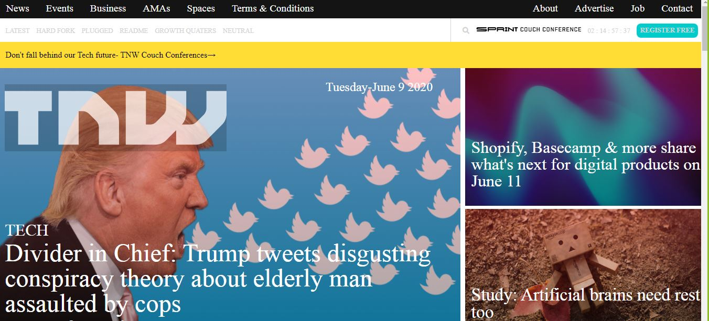

## The Next Web
This is The Next Web clone.

PROJECT: BUILDING WITH RESPONSIVE DESIGN
<br>
In this project, our main aim was to learn how to build a responsive website with media queries, flexbox, grid and float. The website is responsive on different screen sizes, such as mobile, tablet and desktop.

Project Design Screenshot : 


## Built With

- HTML5
- CSS3

## Live Demo

[Live Demo Link](https://rawcdn.githack.com/Godswilly/the-next-web/e0cd6cf04da896e7b532e0f89a75c8e5c538a7e0/index.html)

## Getting started
**We cloned The Next Web. The main aim was to make the website responsive in devices of different screen sizes.The elements get placed and styled roughly the same way as the source, so functionality is not a priority.**

We used the browser’s developer tools to inspect the real The Next Web page to understand how elements are placed and styled.
We built our own page in a .html text file and opened it in our browser to check it out. We carried out the following steps:
  - First setup a github repository for the project.
  - Then create a .html file where all our HTML markup will go.
  - Create a .css file where all our styling code will reside.


## How To Use 🔧

From your command line, first clone the project:

```bash
# Clone this repository
$ git clone https://github.com/Godswilly/the-next-web/tree/the-next-web-branch

# Go into the repository
$ cd the-next-web-branch


```

## CONTRIBUTORS
👤 **Kalu Agu Kalu**

- [Github]( https://github.com/Godswilly)
- [Twitter](https://twitter.com/KaluAguKalu17)
- [Linkedin](https://www.linkedin.com/in/kalu-agu-kalu/)

👤 **Aye Daniel A**

- [Github](https://github.com/Alaska01)
- [Twitter](https://twitter.com/AyeAsoo)
- [Linkedin](https://www.linkedin.com/in/daniel-asoo-aye-178500140/)

## Show your support

Give a ⭐️ if you like this project!

## Acknowledgments

- Thanks to Microverse and The Odin Project.

## 📝 License

This project is [MIT](lic.url) licensed.


